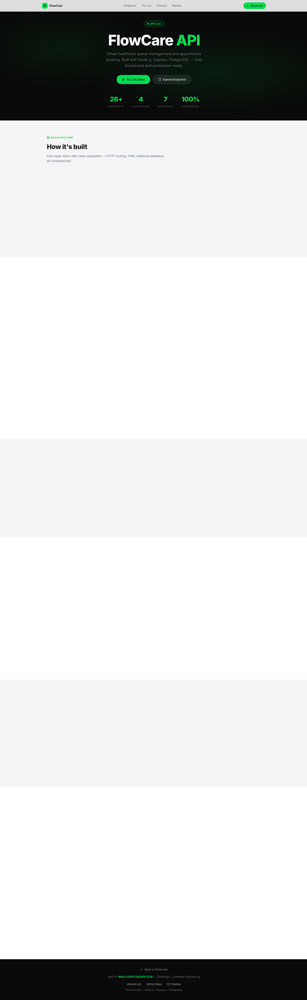

# FlowCare API — Smart Healthcare Queue Management

> **[View All Submissions — alizaabi.om/rihal-codestack](https://alizaabi.om/rihal-codestack/)**


**Live API:** [alizaabi.om/rihal-codestack/flowcare-api/health](https://alizaabi.om/rihal-codestack/flowcare-api/health) | **API Explorer:** [alizaabi.om/rihal-codestack/flowcare.html](https://alizaabi.om/rihal-codestack/flowcare.html)

---


A production-ready REST API for managing healthcare clinic queues, appointments, and staff — built for the **Rihal CODESTACKER 2026** competition.

---



---

## Features

- **26+ REST endpoints** covering the full appointment lifecycle
- **4-role RBAC** — Admin, Manager, Staff, Customer — with JWT authentication
- **Queue management** — real-time queue position, status tracking, and slot-based scheduling
- **Slot management** with conflict detection to prevent double-booking
- **Audit logging** — every write operation logged, with CSV export
- **Soft deletes** with 30-day retention and automatic cleanup
- **Rate limiting** — 100 requests per 15-minute window per IP
- **File uploads** with type and size validation
- **2 seeded branches** — Al Khuwair (Muscat) and Salalah — with realistic demo data
- **7 data models** for a complete healthcare domain

---

## Tech Stack

| Layer | Technology |
|---|---|
| Runtime | Node.js 18 |
| Framework | Express.js |
| Database | PostgreSQL 16 |
| ORM | Sequelize |
| Auth | JWT (jsonwebtoken) |
| Containerization | Docker Compose |
| File Handling | Multer |
| Rate Limiting | express-rate-limit |

---

## API Endpoints

| Method | Endpoint | Description | Role |
|---|---|---|---|
| POST | `/api/auth/login` | Login and get JWT token | Public |
| POST | `/api/auth/register` | Register a new customer | Public |
| GET | `/api/health` | Health check | Public |
| GET | `/api/branches` | List all branches | All |
| POST | `/api/branches` | Create a branch | Admin |
| PUT | `/api/branches/:id` | Update a branch | Admin/Manager |
| DELETE | `/api/branches/:id` | Soft delete a branch | Admin |
| GET | `/api/service-types` | List service types | All |
| POST | `/api/service-types` | Create a service type | Admin/Manager |
| GET | `/api/staff` | List staff members | Admin/Manager |
| POST | `/api/staff` | Add a staff member | Admin |
| PUT | `/api/staff/:id` | Update staff | Admin/Manager |
| GET | `/api/slots` | List available slots | All |
| POST | `/api/slots` | Create a slot | Admin/Manager |
| PUT | `/api/slots/:id` | Update a slot | Admin/Manager |
| DELETE | `/api/slots/:id` | Soft delete a slot | Admin |
| GET | `/api/customers` | List customers | Admin/Manager/Staff |
| POST | `/api/customers` | Create a customer | Admin/Staff |
| GET | `/api/appointments` | List appointments | Role-filtered |
| POST | `/api/appointments` | Book an appointment | All |
| PUT | `/api/appointments/:id` | Update appointment | Admin/Manager/Staff |
| DELETE | `/api/appointments/:id` | Cancel appointment (soft) | Admin/Manager |
| GET | `/api/appointments/:id/queue` | Get queue position | All |
| GET | `/api/audit-logs` | View audit logs | Admin |
| GET | `/api/audit-logs/export` | Export audit logs as CSV | Admin |
| POST | `/api/upload` | Upload a file | Authenticated |

---

## Data Models

```
Branch
  └── ServiceType (belongs to Branch)
  └── Staff (belongs to Branch)
  └── Slot (belongs to Branch + ServiceType)
        └── Appointment (belongs to Slot + Customer)
              └── AuditLog (tracks all mutations)
Customer
  └── Appointment (has many)
```

| Model | Key Fields |
|---|---|
| **Branch** | name, location, phone, isActive |
| **ServiceType** | name, description, avgDurationMinutes, branchId |
| **Staff** | name, email, role, branchId |
| **Slot** | date, startTime, endTime, capacity, branchId, serviceTypeId |
| **Customer** | name, email, phone, fileUrl |
| **Appointment** | status, queueNumber, notes, slotId, customerId |
| **AuditLog** | action, entity, entityId, userId, metadata |

---

## Quick Start

### Prerequisites
- Docker and Docker Compose installed

### Run locally

```bash
git clone https://github.com/zaabi1995/rihal-flowcare.git
cd rihal-flowcare
docker-compose up --build
```

The API will be available at `http://localhost:3000`.

Seed the database (in a separate terminal):

```bash
docker compose exec app npm run seed
```

### Default credentials

| Role | Email / Username | Password |
|---|---|---|
| Admin | admin | admin123 |
| Manager | sara@flowcare.om | staff123 |
| Staff | rashid@flowcare.om | staff123 |
| Customer | ahmed@example.com | pass123 |

### Test the health endpoint

```bash
curl http://localhost:3000/api/health
```

---

## Environment Variables

| Variable | Default | Description |
|---|---|---|
| `PORT` | `3000` | API port |
| `DB_HOST` | `db` | PostgreSQL host |
| `DB_PORT` | `5432` | PostgreSQL port |
| `DB_NAME` | `flowcare` | Database name |
| `DB_USER` | `postgres` | Database user |
| `DB_PASS` | `postgres` | Database password |
| `JWT_SECRET` | — | JWT signing secret |
| `RATE_LIMIT_WINDOW_MS` | `900000` | Rate limit window (15 min) |
| `RATE_LIMIT_MAX` | `100` | Max requests per window |

---

## Roles

| Role | Scope | Permissions |
|---|---|---|
| Admin | System-wide | Full access to everything |
| Manager | Own branch | Manage slots, staff, view branch logs |
| Staff | Own schedule | View schedule, update appointment status |
| Customer | Own data | Book, reschedule, cancel, view history |

---

## Seed Data

The seed script creates:
- 2 branches: Al Khuwair (Muscat) + Salalah
- 4 service types per branch
- 6 staff members (1 manager + 2 staff per branch)
- 5 customers
- 12+ slots across the next 5 days

---

## Author

**Ali Al Zaabi**
Built for Rihal CODESTACKER 2026 — Challenge #2: Backend / Software Engineering

---

## Other Challenges
- [Visit Oman](https://github.com/zaabi1995/rihal-visit-oman) — Challenge #1: Frontend Development
- [DE Pipeline](https://github.com/zaabi1995/rihal-de-pipeline) — Challenge #4: Data Engineering
- [Muscat 2040](https://github.com/zaabi1995/rihal-muscat-2040) — Challenge #6: Data Analytics
